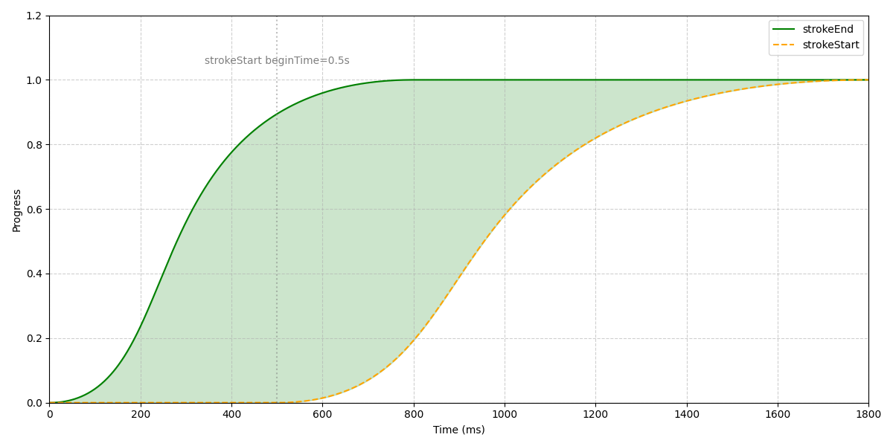
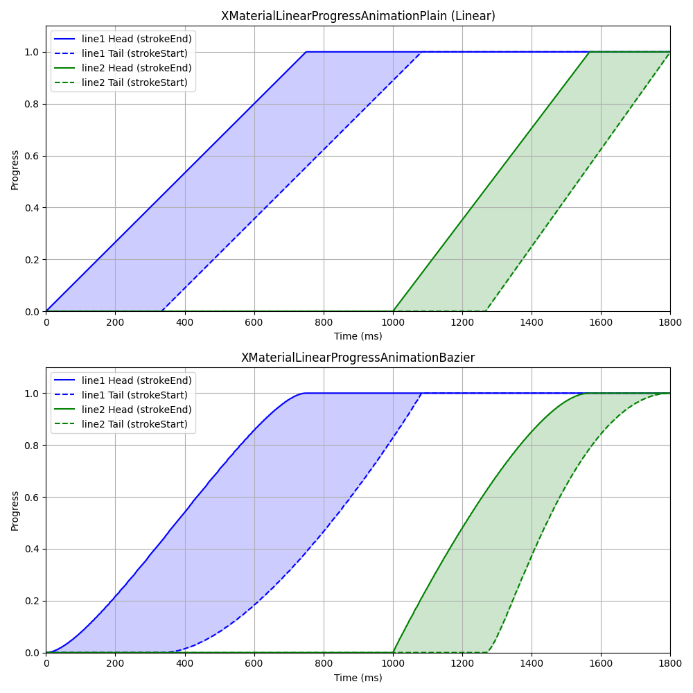

# XMaterialProgressView


## How to use

See [Example](Example/XMaterialProgressView/ViewController.swift)

## Installation

```ruby
pod 'XMaterialProgressView', :git => 'https://github.com/iStarEternal/XMaterialProgressView.git'
```

## Figure

### XMaterialCircleProgressView



### XMaterialLinearProgressView



## Author

hyh, 576681253@qq.com

## License

XMaterialProgressView is available under the MIT license. See the LICENSE file for more info.
